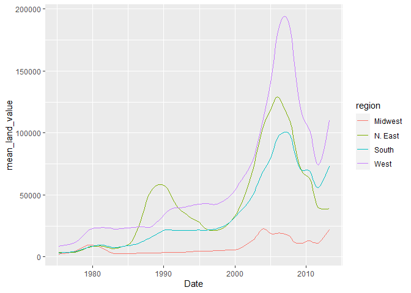
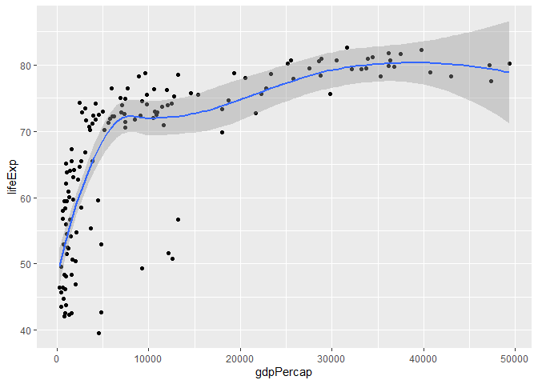
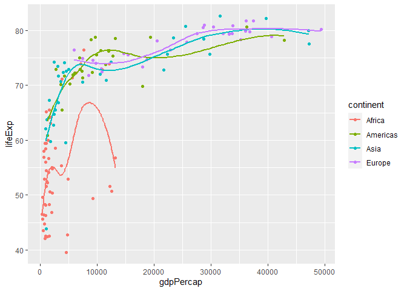
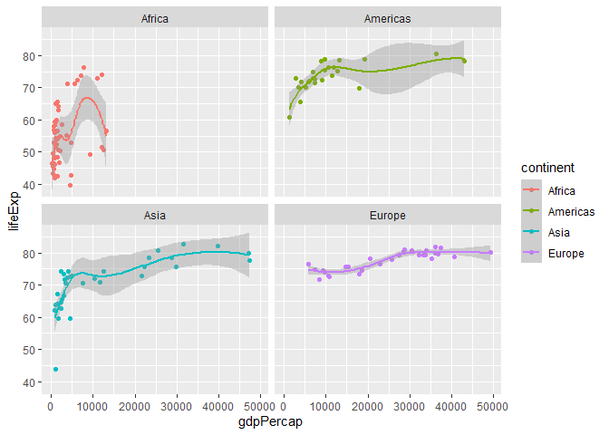
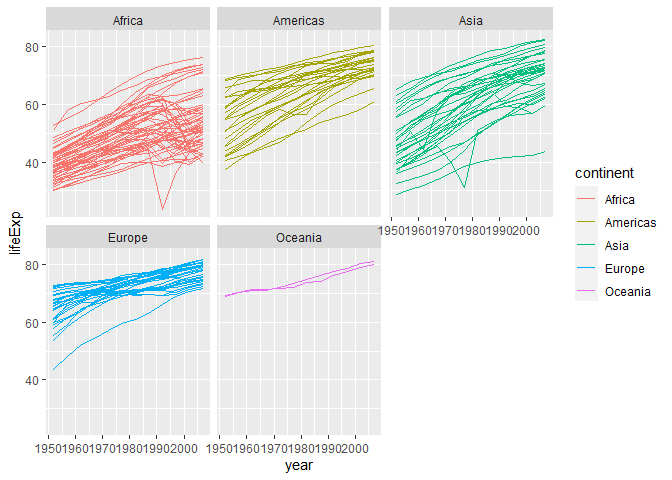

Assignment_5
================

# Assignment 5

## Load packages

To start, load all the required packages with the following code.
Install them if they are not installed yet.

``` r
library(tidyverse)
library(knitr)
library(ggplot2)
library(gapminder)
```

<br>

``` r
housing <- read_csv("https://raw.githubusercontent.com/nt246/NTRES-6100-data-science/master/datasets/landdata_states.csv")
housing %>%
  head() %>% 
  kable() 
```

| State | region |    Date | Home.Value | Structure.Cost | Land.Value | Land.Share..Pct. | Home.Price.Index | Land.Price.Index | Year | Qrtr |
|:------|:-------|--------:|-----------:|---------------:|-----------:|-----------------:|-----------------:|-----------------:|-----:|-----:|
| AK    | West   | 2010.25 |     224952 |         160599 |      64352 |             28.6 |            1.481 |            1.552 | 2010 |    1 |
| AK    | West   | 2010.50 |     225511 |         160252 |      65259 |             28.9 |            1.484 |            1.576 | 2010 |    2 |
| AK    | West   | 2009.75 |     225820 |         163791 |      62029 |             27.5 |            1.486 |            1.494 | 2009 |    3 |
| AK    | West   | 2010.00 |     224994 |         161787 |      63207 |             28.1 |            1.481 |            1.524 | 2009 |    4 |
| AK    | West   | 2008.00 |     234590 |         155400 |      79190 |             33.8 |            1.544 |            1.885 | 2007 |    4 |
| AK    | West   | 2008.25 |     233714 |         157458 |      76256 |             32.6 |            1.538 |            1.817 | 2008 |    1 |

1.1 Washington DC was not assigned to a region in this dataset.
According to the United States Census Bureau, however, DC is part of the
South region. Here: - Change the region of DC to “South” (Hint: there
are multiple ways to do this, but mutate() and ifelse() might be
helpful) - Create a new tibble or regular dataframe consisting of this
new updated region variable along with the original variables State,
Date and Land.Value (and no others) - Pull out the records from DC in
this new data frame. How many records are there from DC? Show the first
6 lines.

``` r
housing$region <- ifelse(housing$State == "DC" & is.na (housing$region), "South", housing$region)

housing %>%
  filter(State == "DC") %>% 
  select(region, State, Land.Value,Date) %>% 
  head(6)  %>%
  kable() 
```

| region | State | Land.Value |    Date |
|:-------|:------|-----------:|--------:|
| South  | DC    |     290522 | 2003.00 |
| South  | DC    |     305673 | 2003.25 |
| South  | DC    |     323078 | 2003.50 |
| South  | DC    |     342010 | 2003.75 |
| South  | DC    |     361999 | 2004.00 |
| South  | DC    |     382792 | 2004.25 |

##1.2

``` r
housing<- housing %>% group_by(region,Date)%>%
  mutate(mean_land_value = mean(Land.Value))

housing %>% group_by(region,Date)%>%
  mutate(mean_land_value = mean(Land.Value)) %>% 
  select(region, Date, mean_land_value) %>% 
  filter(region=="Midwest")%>% 
  head(6)  %>%
  arrange(mean_land_value) %>%
  kable() 
```

| region  |    Date | mean_land_value |
|:--------|--------:|----------------:|
| Midwest | 1975.25 |        2452.167 |
| Midwest | 1975.50 |        2498.917 |
| Midwest | 1975.75 |        2608.167 |
| Midwest | 1976.00 |        2780.000 |
| Midwest | 1976.25 |        2967.333 |
| Midwest | 1976.50 |        3212.833 |

##1.3

``` r
housing %>% 
  ggplot(aes(x=Date,y=mean_land_value,color=region)) +
  geom_line()
```

<!-- -->

##2

``` r
gapminder%>%
  head()%>%
  kable()
```

| country     | continent | year | lifeExp |      pop | gdpPercap |
|:------------|:----------|-----:|--------:|---------:|----------:|
| Afghanistan | Asia      | 1952 |  28.801 |  8425333 |  779.4453 |
| Afghanistan | Asia      | 1957 |  30.332 |  9240934 |  820.8530 |
| Afghanistan | Asia      | 1962 |  31.997 | 10267083 |  853.1007 |
| Afghanistan | Asia      | 1967 |  34.020 | 11537966 |  836.1971 |
| Afghanistan | Asia      | 1972 |  36.088 | 13079460 |  739.9811 |
| Afghanistan | Asia      | 1977 |  38.438 | 14880372 |  786.1134 |

##2.1

``` r
gapminder %>%
  filter(year==2007)%>%
  ggplot(aes(x=gdpPercap,y=lifeExp))+
  geom_point()
```

<!-- -->

##2.2

``` r
gapminder %>%
  filter(year==2007)%>%
  ggplot(aes(x=gdpPercap,y=lifeExp))+
  geom_point()+
  geom_smooth()
```

<!-- --> ##2.3

``` r
gapminder %>%
  filter(year==2007)%>%
  filter(continent!="Oceania")%>%
  ggplot(aes(x=gdpPercap,y=lifeExp,col=continent))+
  geom_point()+
  geom_smooth( se=FALSE)
```

<!-- -->

##2.4

``` r
gapminder %>%
  filter(year==2007)%>%
  filter(continent!="Oceania")%>%
  ggplot(aes(x=gdpPercap,y=lifeExp,col=continent))+
  geom_point()+
  geom_smooth()+
  facet_wrap(.~continent)
```

<!-- -->

##2.5

``` r
gapminder %>%
  ggplot(aes(x=year, y=lifeExp, col=continent, group=country))+
  geom_line()+
  facet_wrap(.~continent)
```

<!-- -->

##2.6

``` r
gapminder %>%
  filter(continent=="Asia") %>%
  head(6)  %>%
  kable() 
```

| country     | continent | year | lifeExp |      pop | gdpPercap |
|:------------|:----------|-----:|--------:|---------:|----------:|
| Afghanistan | Asia      | 1952 |  28.801 |  8425333 |  779.4453 |
| Afghanistan | Asia      | 1957 |  30.332 |  9240934 |  820.8530 |
| Afghanistan | Asia      | 1962 |  31.997 | 10267083 |  853.1007 |
| Afghanistan | Asia      | 1967 |  34.020 | 11537966 |  836.1971 |
| Afghanistan | Asia      | 1972 |  36.088 | 13079460 |  739.9811 |
| Afghanistan | Asia      | 1977 |  38.438 | 14880372 |  786.1134 |

##2.7

## Historical event: Khmer_Rouge in Cambodia in around 1980 caused 2 million people died.

``` r
gapminder %>%
  filter(continent=="Asia") %>%
  ggplot(aes(x=year, y=lifeExp))+
  geom_line(col="blue")+
  facet_wrap(.~country)
```

<!-- -->
